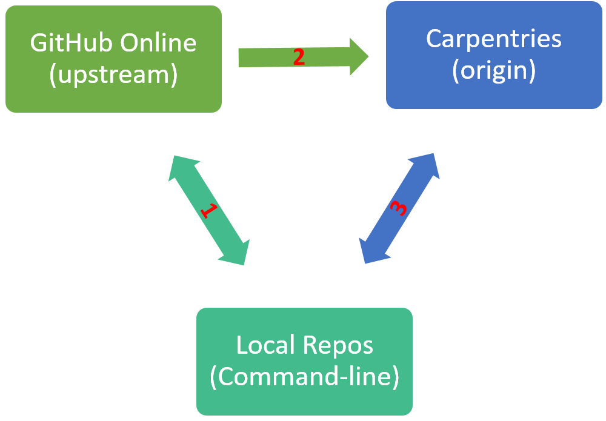
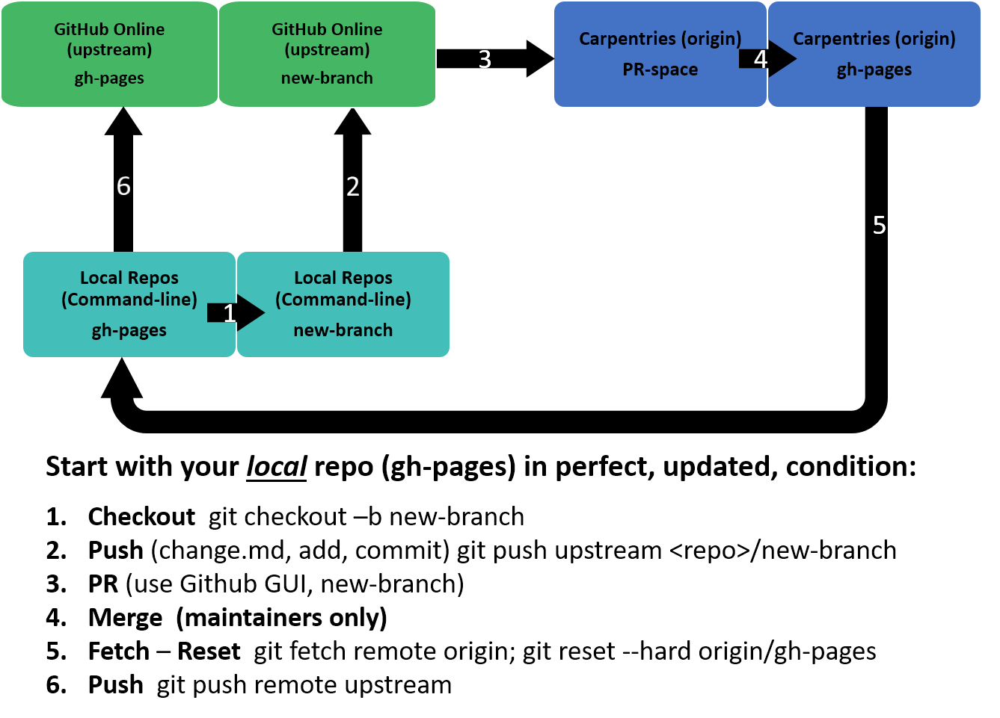
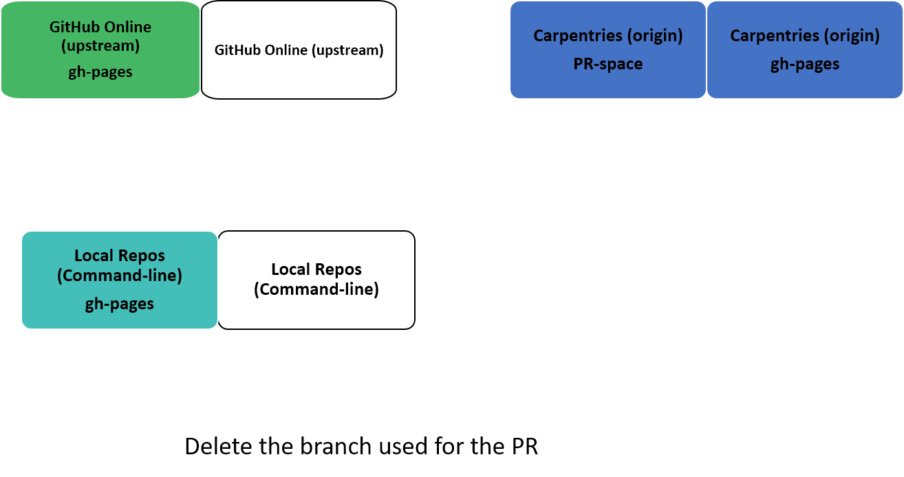

### Problem to be addressed
- To send a properly formatted PR to a Carpentries Lesson

### Disclaimer:
- There are [other ways](https://github.com/hoytpr/git-beginner/blob/gh-pages/Other-options.md) to do this, but a simple, consistent way needs to be spelled out. This is my suggestion. Many have said that "revert" rather than "reset" is a better option, but this is simple and works. If you want to create a better option, that's GREAT! Let's please put that page here or on the Carpentries site.
- Note that many good ways to remove commits are found at:
https://sethrobertson.github.io/GitFixUm/fixup.html

### Issues
- Need a perfectly "clean" online GitHub repo to make a clean PR
- Updates to lessons occur, making your online lessons "behind" the official repo
- Cannot update your GitHub repo from the Carpentries without creating an update "history"
- Update histories can be huge, making them unmanageable by maintainers

### Key Points
- How to create a clean online repo for making a pull request
- How to reset your local repos and GitHub repos after a PR

### How does GitHub REALLY work?


**The GIT Triangle** (above) shows the three basic areas you'll be working

**SHOWN BELOW** is how each basic area is divided into parts called branches
Most of you know this, but this just illustrates which branches are being used when you are pushing and pulling.  


**There is an order to this process**
- The arrows are numbered to help guide you through a simple PR
- Once the PR is merged, you will want to delete your new-branch locally and online




**Now, you'll want to make sure your repo is up to date with the Carpentries
as shown below using Max Belkin's suggestions, then go ahead and make a new branch
for your next changes (if any)**

## Rationale

During active lesson updates, it is common for **_your online_** GitHub repos to fall behind commits at the Carpentries. 
There may be an automated way for these to be synched, but it's mysterious.

After several attempts to fix this, I found myself having to simply **delete and 
recreate** my online AND my local repos (by forking or cloning) before I could then make clean changes 
on a branch, and offer it as a PR to the Carpentries maintainer.  Being a maintainer 
myself, I often saw people include multiple "other" actions (adding files, changing files, 
correcting mistakes, etc.) that are included in PRs.

On the maintainers Slack channel I asked how to easily create a clean Github repo for a PR.

I got this helpful reply from Maxim Belkin:

> Use branches for pull requests:
> 
> ```
> git checkout -f gh-pages
> git fetch origin
> git reset --hard origin/gh-pages
> git branch my-changes
> git checkout my-changes
> # make changes
> git add -u
> git commit -m ...
> git push <your-fork>
> # submit pull request using "my-changes" branch
> git checkout gh-pages
> ```
>
> then, if you need to make changes to your pull request:
> 
> ```
> git checkout my-changes
> # make more changes
> git commit -am "message" # same as `git add -u` followed by `git commit -m`
> git push <your fork> # (<your fork> might be "your repo/new-branches", or sometimes just "git push" works)
> git checkout gh-pages
> ```
> 
> `git pull` is needed only to update the main branch (`gh-pages`) or when you've done changes to your 
> "my-changes" branch on GitHub via web interface and would like to pull them to your computer <== **this is important!**
> 

*Maxim's advice worked!*
*But I was still having problems with remote GitHub Repos already ahead or behind the Carpentries repos*

(We aren't teaching GitHub Desktop, probably for good reasons. 
So forget the GitHub Desktop for now)

## Common misconceptions of GitHub Management:

1. One sees something that is an issue
2. One notices their online repo is behind the Carpentries repo by two (or more or less) commits
3. **Instinct** is to update your online GitHub repo by just pulling changes from Carpentries, then merging them.
4. **This doesn't work** because your online updated pull from the Carpentries now shows up as a part of your online repo (part of it's "history")

**Specific example:** Looking at a comparison between repos, one update pulled to an online GitHub repo included 2,048 additions and 1,617 deletions from earlier. This would then be sent, along with your *one* change, back to the maintainers! 

### Bottom line: You can't use the GUI to get rid of the "history" of your repos, which will be included in your commits. But you need a clean GitHub online repo for a PR

**Question:** How to get everything up to date?

**Answer:** You **must** use the local repos, and the command line. 
- Once this becomes easy, you can move changes on your remote GitHub repo where they render properly. 
- (Getting Ruby installed to run Jekyl for local rendering of the page can be HARD)

### One detailed protocol: 

- Open GitBash whether updating an existing repo locally, or are cloning a new repo locally
- Run: `git init` inside the repo (folder/directory)
- Setup the remote "origin" (the Carpentries repo, for example the "wrangling-genomics")

`git remote add origin https://github.com/datacarpentry/wrangling-genomics`

- check the remote origin is correct

```
git remote -v
origin  https://github.com/datacarpentry/wrangling-genomics.git (fetch)
origin  https://github.com/datacarpentry/wrangling-genomics.git (push)
```

- Setup the remote "upstream" as **your** remote GitHub repo

`git remote add upstream https://github.com/hoytpr/wrangling-genomics`

- check the remote upstream is correct

```
git remote -v
origin  https://github.com/datacarpentry/wrangling-genomics.git (fetch)
origin  https://github.com/datacarpentry/wrangling-genomics.git (push)
upstream        https://github.com/hoytpr/wrangling-genomics.git (fetch)
upstream        https://github.com/hoytpr/wrangling-genomics.git (push)

```

- Make sure you have a "gh-pages" branch and a branch for making changes and PRs

```
$ git branch
* gh-pages
  test-branch
```

- You MUST have a gh-pages branch (and probably do). 
- If you don't have a gh-pages branch, or a branch for making changes (in my example it's named 'test-branch') to make changes for the PR you can create one. For example:

```
$ git checkout -b test-branch
Switched to a new branch 'test-branch'
```

- Make *sure* you made the branch correctly.

```
$ git branch
  gh-pages
* test-branch
```

_*NOW*_ Use Max Belkims advice:

> ```
> git checkout -f gh-pages
> git fetch origin
> git reset --hard origin/gh-pages
> git branch
>    gh-pages
>    test-branch
> git checkout test-branch
> # make changes
> git add -u
> git commit -m ...       *<== add commit message here*
> git push upstream https://github.com/hoytpr/wrangling-genomics
> # submit pull request using "test-branch" branch      *<== using your online GUI*
> git checkout gh-pages
> ```

### Remember:
- Make changes to the Carpentries lesson using the command-line on **your local** repo using test-branch (not gh-pages)
- Push changes to same test-branch (not gh-pages) of your online GitHub repo
- Send in PR (to SWC lesson site) from **remote** Github repo (GUI) using test-branch (not gh-pages)
- When accepted by maintainer and merged, **delete your** test-branch (at SWC lesson site)
- Deleting your branch which will show as an option on the PRs tab of the Carpentries lesson after merging.

## To clean things up
- Go back to local command line

The remote setup should still look like this:

```
$ git remote -v
origin  https://github.com/datacarpentry/wrangling-genomics (fetch)
origin  https://github.com/datacarpentry/wrangling-genomics (push)
upstream        https://github.com/hoytpr/wrangling-genomics (fetch)
upstream        https://github.com/hoytpr/wrangling-genomics (push)
```

Clean up the local repo (FYI: To delete a branch; first switch to a different branch, then use `-d`)

```
$ git checkout gh-pages
Switched to branch 'gh-pages'
$ git branch -d test-branch
Deleted branch test-branch (was 3a0742a).
```

**Fetch** the new Carpentries lesson and **reset** your gh-pages branch

```
git checkout gh-pages
git fetch origin
git reset --hard origin/gh-pages
```

Then push the new lesson up to your online Github repo, and make a new branch for changes

```
git push upstream
git checkout -b new-branch
Switched to a new branch 'new-branch'
git push --set-upstream origin new-branch
```

NOW everything should be up to date and ready for any new changes. 

### Common Problem with simple solution

- If your upstream has some stupid commits you want to eliminate
because they were pulls or pushes after you made changes to SWC.
- First make your LOCAL repo up to date as specified above, then run this command: 

`$ git push -f upstream gh-pages`

NOW your upstream GitHub will be ***forced*** to look like your local repo and
will be up to date with SWC gh-pages

`____________________________________________`

### Common Problem, more detailed answer

If I changed something on my remote GitHub page, how can I reset it?

### Answer is easy, but there are confusing parts of Git that you might see:

1. Your local repo is great, as you just fetched and reset it from SWC.

```
git checkout gh-pages
git fetch origin
git reset --hard origin/gh-pages
```

2. You want to make your GitHub upstream repo perfect also, but: 

```
$ git push upstream
To https://github.com/hoytpr/shell-novice
 ! [rejected]        gh-pages -> gh-pages (fetch first)
error: failed to push some refs to 'https://github.com/hoytpr/shell-novice'
hint: Updates were rejected because the remote contains work that you do
hint: not have locally. This is usually caused by another repository pushing
hint: to the same ref. You may want to first integrate the remote changes
hint: (e.g., 'git pull ...') before pushing again.
hint: See the 'Note about fast-forwards' in 'git push --help' for details.
```

3. And even more confusing: 

```
$ git status
On branch gh-pages
Your branch is up to date with 'origin/gh-pages'.     <== this is only true for ORIGIN!

nothing to commit, working tree clean                 <==  But it looks like everything is fine!

```

4. But your GitHub online repo says something like:

	`"This is 2 commits behind <SWC-repo>"`         <==  This is the truth!!!!!

5. To see the upstream changes you need to be on the same branch, and use `git diff` specifically. For Example:

```
$ git checkout hoyt-patches
Switched to branch 'hoyt-patches'
$ git diff upstream/hoyt-patches
                                          <== nothing returned = no differences
$ git checkout gh-pages
Switched to branch 'gh-pages'

$ git diff upstream/gh-pages
diff --git a/aio.md b/aio.md
index 6d93852..a91fb0f 100644
--- a/aio.md
+++ b/aio.md
@@ -1,6 +1,6 @@
 ---
-layout: page
-permalink: /aio/
+layout: page
+title: Aio
 ---
 <script>
   window.onload = function() {
diff --git a/reference.md b/reference.md
index 87a20cc..6260be6 100644
--- a/reference.md
+++ b/reference.md
@@ -1,6 +1,6 @@
 ---
 layout: reference
-permalink: /reference/
+title: Reference
 ---

 ## Glossary
diff --git a/setup.md b/setup.md
index e5c3cf4..bc92b52 100644
--- a/setup.md
+++ b/setup.md
@@ -1,7 +1,6 @@
 ---
 layout: page
 title: Setup
-permalink: /setup/
 ---

 This lesson requires a working spreadsheet program. If you don't have a spreadsheet program already, you can use LibreOffice. It's a free, open source spreadsheet program.
```

6. To fix this you can FORCE the push upstream

```
$ git push -f upstream gh-pages
Enumerating objects: 179, done.
Counting objects: 100% (176/176), done.
Delta compression using up to 6 threads
Compressing objects: 100% (58/58), done.
Writing objects: 100% (157/157), 24.52 KiB | 4.09 MiB/s, done.
Total 157 (delta 111), reused 145 (delta 99)
remote: Resolving deltas: 100% (111/111), completed with 15 local objects.
To https://github.com/hoytpr/shell-novice
 + c4ba13b...ff68e20 gh-pages -> gh-pages (forced update)
```

7. Then go to the GitHub online repo and refresh the screen. It'll say:

	`"This branch is even with swcarpentry:gh-pages."`

YAY! (Fin)
